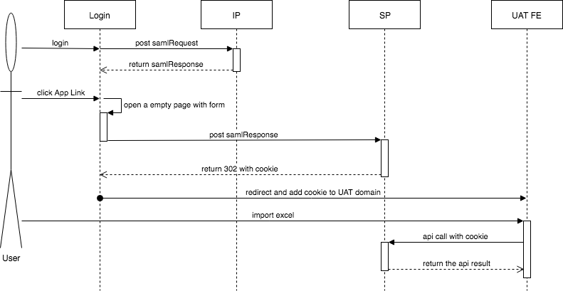
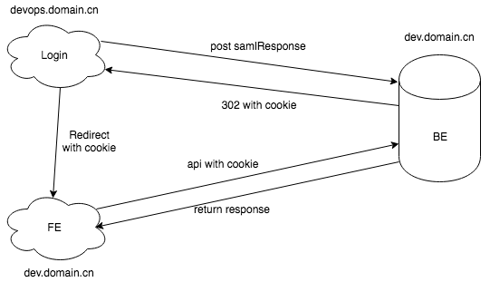

# SSO

### SSO with Authentication Code

```mermaid
sequenceDiagram
	participant User
	participant Browser
	participant RP as Relying Part
  participant OP as OpenId Provider
  participant OS as Other Service

	User->>Browser: login
	Browser->>+RP: request to /autherize
	RP-->>-User: redirect to login promt (url include client-id and return-url)
	User->>+OP: authenticate and consent
	OP-->>-Browser: redirect to return-url(empty page) with Authentication Code
	Browser->>+RP: empty page request to /token with Code
	RP->>+OP: request to /token with client-id & code & client-secret
	OP-->>-RP: return id-token & access token & refresh token
	RP-->>-Browser: return refresh token via httponly cookie
	Browser->>+RP: request to /refresh-token
	RP-->>-Browser: return customized access-token
	Browser-->>User: login success
	User->>Browser: click play button
	Browser->>OS: request to /play with access-token
	OS->>+RP: rquest to /verify with access-token
	RP-->>-OS: verified with 200
	OS-->>Browser: play success with 200
	Browser-->>User: play success
	
```

### Referance

- https://hasura.io/blog/best-practices-of-using-jwt-with-graphql/

- [OAuth 2.0](https://auth0.com/docs/flows/authorization-code-flow)


### SSO with Saml




#### Simulate login



- CORS(Cross-Origin Resource Sharing)
  - Same Origin Policy
  - Trigger conditions
    - Different domains, e.g.: http://example.com —> http://api.com
    - Different sub domains, e.g.: http://a.example.com —> http://b.example.com 
    - Different ports, e.g.: http://localhost:3000 —> http://localhost:8000
    - Different potocols: e.g.: https://exmple.com —> http://exmple.com
  - The affected resources
    - Cookie, LocalStorage, IndexDB
    - DOM
    - AJAX
  - Solution
    - Allow CORS — White List
      - preflight request — OPTIONS
      - position — backend / proxy

    - Proxy — Nginx/ALB
      - Forward Proxy
      - Reverse Proxy
      - 

    - Form action - Using the form action will allow the CORS

      ```html
      <form 
            action="https://someurl/api/login" 
            method="post" 
            encType="application/x-www-form-urlencoded"
      >
      	<input type="text" name="request-key" value="request-value"/>
        <button type="submit">submit</button>
      </form>
      ```

